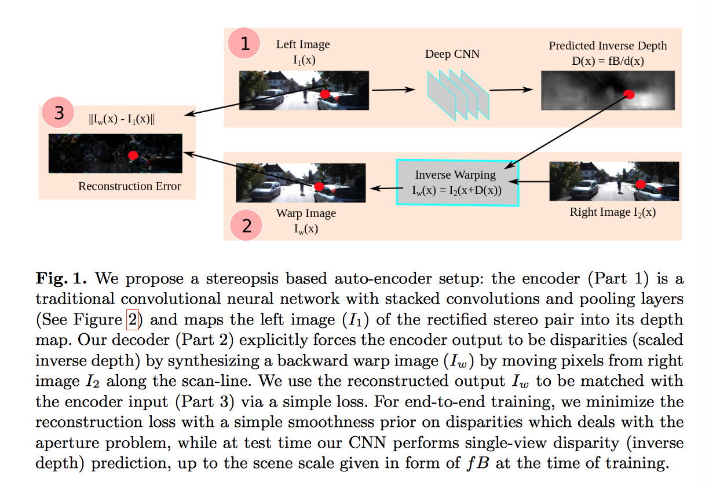

# Unsupervised CNN for Single View Depth Estimation: Geometry to the Rescue

Paper link: [https://arxiv.org/pdf/1603.04992v2.pdf](https://arxiv.org/pdf/1603.04992v2.pdf)

- single view depth prediction
- unsupervised framework : without requiring pre-training stage or annotated ground-truth depth
- analogous to an autoencoder

## Approach

- Make use of pairs of images with a known camera motion, such as stereo pairs.
- CNN: learn the complex non-linear transformation which converts the image to a depth-map
  - loss: photometric difference between the input (source image and the inverse warped image) differentiable and highly correlated tieh prediction error
- Interpreted in the context of convolutional autoencoeders

### Autoencoder loss

- notation: $$i \in \{1 \cdots N\}$$: Training instance 
- notation: $$\{I_i^i, I_2^i\}$$: Rectified stereo pair 
- notation: $$f$$: focal length of the two cameras in a single pre-calibrated stereo rig, which capture the image pairs
- notation: $$B$$: horizontal distance beteen the cameras
- notation: $$d^i(x)$$: the predicted depth of a pixel $x$ in the left of the rig
- notation: $$D^i(x) = fB/d^i(x)$$ the motion of the pixel along the scan-line
- notation: $$I_w^i = I^i_2()$$  

Inline math: $$\int_{-\infty}^\infty g(x) dx$$

Block math:

$$
\int_{-\infty}^\infty g(x) dx
$$

