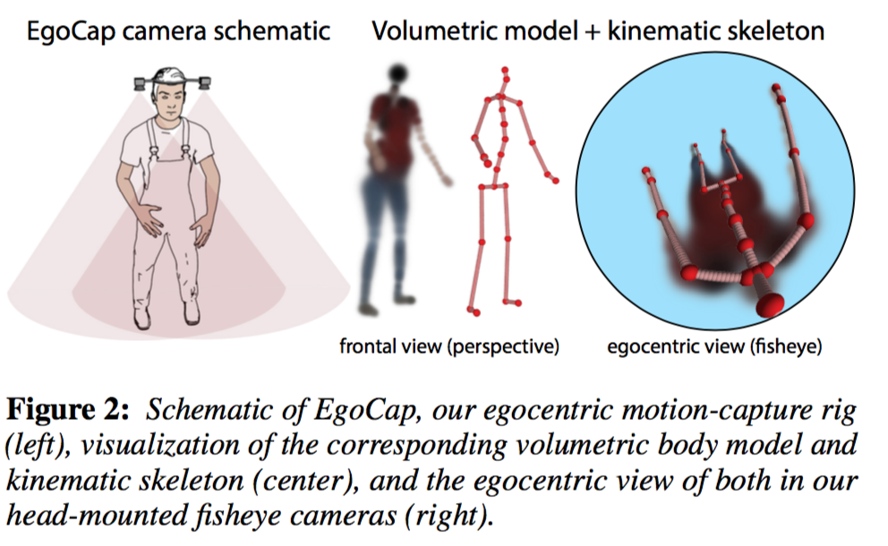
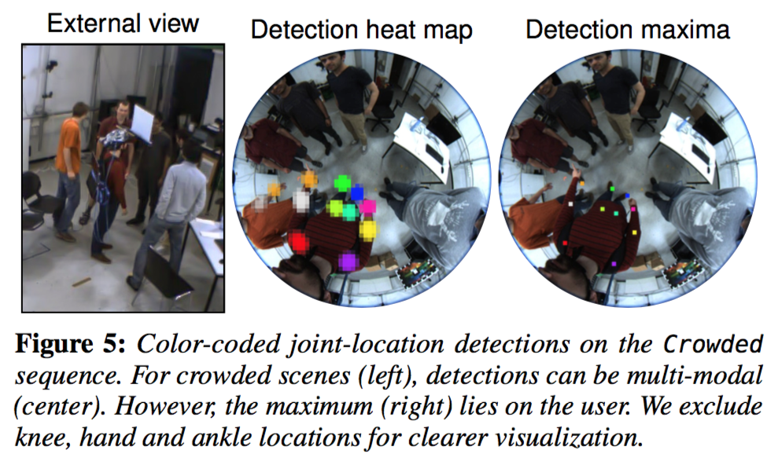
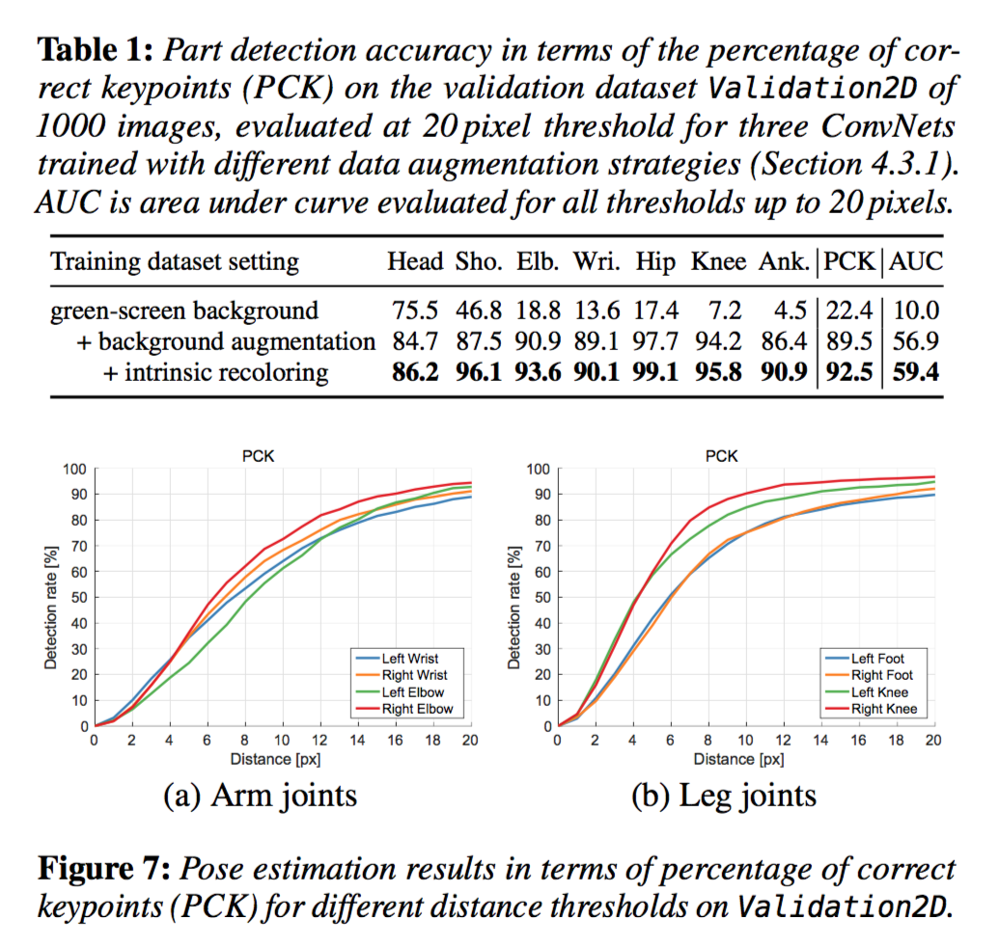
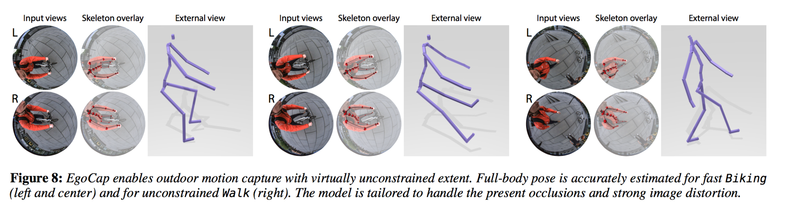
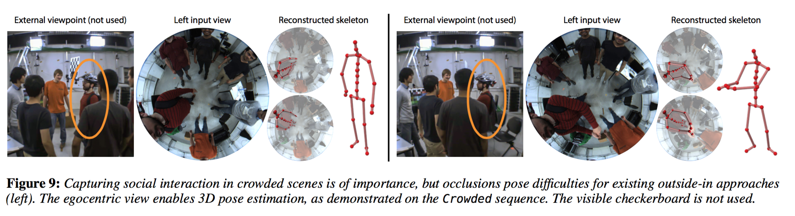

# EgoCap: Egocentric Marker-less Motion Capture with Two Fisheye Cameras

tags: Deep Learning, Motion Capture,  Pose Estimation, SIGGRAPH 2016

## Summary:
New method for real-time, marker-less, and egocentric motion capture: 

estimating the full-body skeleton pose from a lightweight stereo pair of fisheye cameras attached to a helmet or virtual reality headset。

> EgoCap: an egocentric motion-capture approach that estimates full-body pose from a pair of optical cameras carried by lightweight headgear 

### Contribution

1.   a new egocentric inside-in sensor rig with only two head-mounted, downward-facing commodity video cameras with fisheye lenses
2.   a new marker-less motion capture algorithm tailored to the strongly distorted egocentric fisheye views.
  - __combines a generative model-based skeletal pose estimation approach (Section 4) with evidence from a trained ConvNet-based body part detector (Section 4.3)__
  - features an analytically differentiable objective energy that can be minimized efficiently
  - work with unsegmented frames and general backgrounds
  - succeeds even on poses exhibiting notable self-occlusions
      - part detector predicts occluded parts, and enables recovery from tracking errors after severe occlusions.
3.   a new approach for automatically creating body part detection training datasets

## Egocentric Camera Design

## Egocentric Full-Body Motion Capture

The setup separates human motion capture into two sub-problems:

1. local skeleton pose estimation with respect to the camera rig
2. global rig pose estimation relative to the environment

- Global pose is estimated with existing structure-from-motion
techniques (Section 6.3)
- formulate skeletal pose estimation as an analysis-by-synthesis-style optimization problem in the pose parameters $\mathbf{p}^t$, that maximizes the alignment of a projected 3D human body model (Section 4.1) with the human in the left $\mathcal{I}^t_{left}$ and the right $\mathcal{I}^t_{right}$ stereo fisheye views, at each video time step $t$.
- use a hybrid alignment energy combining evidence from a generative image-formation model, as well as from a discriminative detection approach.

  $$E(\mathbf{p}^t) = E_{color}(\mathbf{p}^t) + E_{detection}(\mathbf{p}^t)+E_{pose}(\mathbf{p}^t) + E_{smooth}(\mathbf{p}^t)$$
  - The total energy is optimized for every frame.
  - Our generative ray-casting-based image formation model is inspired by light transport in volumetric translucent media, and enables us to formulate a __color-based alignment__ term in $\mathbf{p}^t$ that is analytically differentiable and features an analytically differentiable formulation of 3D visibility (Section 4.2).
  - Our energy also employs constraints from one-shot joint-location predictions in the form of $E_{detection}$ (__detection term__): These predictions are found with a new ConvNet-based 2D joint detector for head-mounted fisheye views, which is learned from a large corpus of annotated training data, and which generalizes to different users and cluttered scenes (Section 4.3)
  - $E_{pose}(\mathbf{p}^t)$ is a regularizer that penalizes violations of anatomical joint-angle limits as well as poses deviating strongly from the rest pose ($\mathbf{p}=\mathbf{0}$)
    $$E_{pose}(\mathbf{p}^t) = \lambda_{limit} \cdot \left( \max(0, \mathbf{p}^t-\mathbf{l}_{upper})^2 + \max(0, \mathbf{l}_{lower}-\mathbf{p}^t)^2 + \lambda_{pose} \cdot huber(\mathbf{p}^t)\right)$$
      - $\mathbf{l}_{lower}$ and $\mathbf{l}_{upper}$ are lower and upper joint-angle limits,
      - $huber(x) = \sqrt{1+x^2} -1 $ is Pseudo-Huber loss function
  - $E_{smooth}(\mathbf{p}^t)$ __temporal smoothness term__:
  $$E_{smooth}(\mathbf{p}^t) = \lambda_{smooth} \cdot huber(\mathbf{p}^{t-1} + \zeta(\mathbf{p}^{t-1} - \mathbf{p}^{t-2}) - \mathbf{p}^t)$$
     -  $\zeta = 0.25$ is a damping factor 
  -  use weight $\lambda_{pose} = 10^{-4}$, $\lambda_{limit}=0.1$, and $\lambda_{smooth} = 0.1$

## 4.1 Body Model

- model the 3D body shape and pose of humans in 3D using the approach proposed by Rhodin et al. [2015]: represents the body volumetrically as a set of $N_q = 91$ isotropic Gaussian density functions distributed in 3D space (__A Versatile Scene Model with Differentiable Visibility Applied to Generative Pose Estimation__ [http://gvv.mpi-inf.mpg.de/projects/DiffVis/](http://gvv.mpi-inf.mpg.de/projects/DiffVis/) [http://gvv.mpi-inf.mpg.de/projects/DiffVis/Rhodin2015DiffVis.pdf](http://gvv.mpi-inf.mpg.de/projects/DiffVis/Rhodin2015DiffVis.pdf))
  - Each Gaussian $G_q$ parameters: standard deviation $\sigma_q$  and location $\mathbf{\mu}_q$ in 3D space, density $c_q$ and color $\mathbf{a}_q$ 
  - The combined density field of the Gaussians, 􏰀$\sum_q c_q G_q$ , smoothly describes the volumetric occupancy of the human in 3D space. Each Gaussian is rigidly attached to one of the bones of an articulated skeleton with 17 joints, whose pose is parameterized by 37 twist pose parameters [Murray et al. 1994].
  - __General automatic human shape and motion capture using volumetric contour cues.__: personalize a 3D parametric human shape model of Gaussian density and skeleton dimensions by fitting it to multi-view images using a volumetric contour alignment energy.
 
## 4.2 Egocentric Volumetric Ray-Casting Model

- __A Versatile Scene Model with Differentiable Visibility Applied to Generative Pose Estimation__ : For color-based model-to-image similarity, we use the ray-casting image formation model of the previously described volumetric body model 
-  describe image formation as- suming a standard pinhole model
  - 

## 4.3 Egocentric Body-Part Detection

### 4.3.1 Dataset Creation

- marker-less motion capture system (Captury Studio of The Captury) to estimate the skeleton motion in 3D from eight stationary cameras placed around the scene. 
- project the skeleton joints into the fisheye images of our head-mounted camera rig.
- We detect the checkerboard in all stationary cameras in which it is visible, and triangulate the 3D positions of its corners
- Using Scara- muzza et al.’s camera distortion model, we then project the 3D joint locations into the fisheye images recorded by our camera rig.

#### Dataset Augmentation

-  replace the background ->  prone to overfitting to a (necessarily) small set of recorded real backgrounds.
-  varying the colors of clothing
-   random gamma curve ($\gamma \in$ [0.5, 2]) to simulate changing lighting conditions.
-   mirror

-   __training set__: 6 subjects,  ~75,000 annotated fisheye images
-   __validation__: 2 subjects

### 4.3.2 Detector Learning

- starting point: 101-layer residual network. trained by by Insafutdinov et al. on the MPII Human Pose dataset (~19,000) and the Leeds Sports Extended dataset (10,000 imgs) (__DeeperCut: A Deeper, Stronger, and Faster Multi-Person Pose Estimation Model__ [https://arxiv.org/pdf/1605.03170v3.pdf](https://arxiv.org/pdf/1605.03170v3.pdf))
- remove the original prediction layers and replace them with ones that output 18 body-part heat maps（head and neck, plus the left and right shoulders, elbows, wrists, hands, hips, knees, ankles and feet.）
- input: resolution of 640×512 pixels
- predicted heat maps: 8× coarser resolution
- fine-tune the ConvNet on fisheye dataset: 220,000 iterations with a learning rate of 0.002, and drop it to 0.0002 for 20,000 additional iterations. (# iterations is chosen based on performance on the validation set)
- randomly scale images during training by up to $\pm15$ to be more robust to variations in user size.

### 4.3.3 Body-Part Detection Energy

- Inspired by Elhayek et al. [2015], who exploit detections in outside- in motion capture, (__Efficient ConvNet-based marker- less motion capture in general scenes with a low number of cameras__
)
- integrate the learned detections, in the form of heat maps, into the objective energy as a soft constraint.
-  For each detection label, the location with maximum confidence, $(\hat{u}, \hat{v})$, is selected and an associated 3D Gaussian is attached to the corresponding skeleton body part. -> his association can be thought of as giving a distinct color to each body- part label.
-  $E_{detection}$ forms the sum over the detec- tion agreements of all body parts and in both cameras
-  $\lambda_{detection} = 1/3$

## 4.4 Real-Time Optimization

## Evaluation

### 5.3 Body-Part Detections
- valuate on a validation set, Validation2D, of 1000 images from a 30,000- frame sequence of two subjects that are not part of the training set and wear dissimilar clothing.
- augmented with random backgrounds

#### Dataset Augmentations
   
#### Detection Accuracy

-  high accuracy, with slightly lower detection reliability of terminal limbs (wrists, feet)

- subject variation is important
- onsecutive frames are not crucial for our per-frame model

### 5.4 3D Body Pose Accuracy

##Applications

### 6.3 Tracking for Immersive VR

#### Global Pose Estimation
 - Global Pose Estimation For free roaming, the global rig pose can be tracked independently of external devices using structure-from-motion in the fisheye view.
 - using the structure-from-motion implementation of Moulon et al. [2013] provided in the OpenMVG library

 
 
 
 
 
 
 
 
 
 