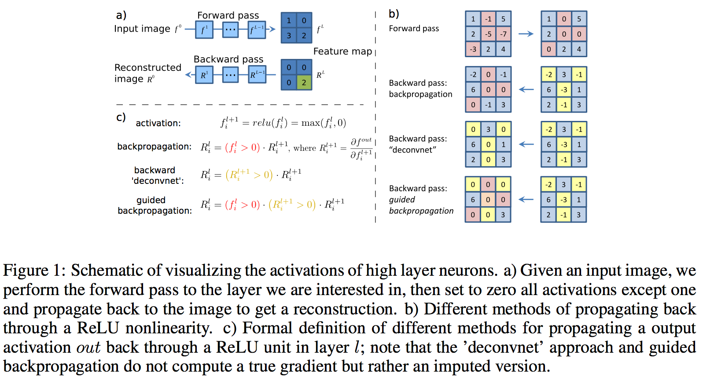

- [ ] Stanford CS231n [lnik](http://cs231n.stanford.edu/slides/2017/cs231n_2017_lecture12.pdf)
- [ ] Blogs:
    - (https://ramprs.github.io/2017/01/21/Grad-CAM-Making-Off-the-Shelf-Deep-Models-Transparent-through-Visual-Explanations.html)[https://ramprs.github.io/2017/01/21/Grad-CAM-Making-Off-the-Shelf-Deep-Models-Transparent-through-Visual-Explanations.html]

- [ ] Zeiler, Matthew D. and Fergus, Rob. Visualizing and understanding convolutional networks. In ECCV, 2014. 
    [Paper Link](https://cs.nyu.edu/~fergus/papers/zeilerECCV2014.pdf)
  * Pick a single intermediate neuron
  * Compute gradient of neuron value with respect to image pixels

- [x] __Gradient visualization with guided backpropagation | Deconvolution __ 
    J. T. Springenberg, A. Dosovitskiy, T. Brox, and M. Riedmiller. Striving for Simplicity: The All Convolutional Net
    [Paper link](https://arxiv.org/abs/1412.6806)
    * Only backprop positive gradients through each ReLU
    
- [x] __ Gradient Ascent | Gradient visualization with saliency maps__
    K. Simonyan, A. Vedaldi, A. Zisserman. Deep Inside Convolutional Networks: Visualising Image Classification Models and Saliency Maps,
   [Paper Link](https://arxiv.org/abs/1312.6034)
  - (Guided) backprop __VS__ Gradient Ascent:
    - (Guided) backprop: Find the part of an image that a neuron responds to
    - Gradient Ascent: Generate a synthetic image that maximally activates a neuron
  - Gradient Ascent:
    1. Initialize image to zeros
    2. Repeat part: Forward image to compute current scores
    3. Repeat part: Backprop to get gradient of neuron value with respect to image pixels
    4. Repeat part: Make a small update to the image
  - (Guided) backprop __VS__ Image-specific Saliency Map
    -  Saliency Map : (Guided) backprop from one-hot class to image and compute saliency
    - 
- [x] __Guided, gradient-weighted class activation mapping__
    R. R. Selvaraju, A. Das, R. Vedantam, M. Cogswell, D. Parikh, and D. Batra. Grad-CAM: Visual Explanations from Deep Networks via Gradient-based Localization, 
   [paper Link](https://arxiv.org/abs/1610.02391)
     - CAM: Class Activation Mapping
        - The weights learned in the last tensor product layer correspond to the neuron importance weights, i.e. - importance of the feature maps for each class of interest.
        - needs a simplified architecture, and hence has to be trained again
     - Grad-CAM heat-map is a weighted combination of feature maps, but followed by a ReLU: weights: global average pooling of the feature map.
     
     
     
## Evaluation Methods

1. __Region Perturbation__

2. __Object Localization / Segmentation__
    - __CAM__: 
        - Localization Evaluation: (ILSVRC2014) bbox generation: simple thresholding by 20% of the max value and take bbox of the largest connected component. [Code](https://github.com/metalbubble/CAM/blob/master/ILSVRC_evaluate_bbox.m)
    - __GRAD-CAM__:
        - 15% of the max value as threshold
        - weakly supervised segmentation
        - Pointing-GAME: (Top-down Neural Attention by excitation Backprop)
    - __Grad-CAM++__:
        - Degine a IoU over the area of bounding box and the heatmap 
        
- Applications:
    - __CAM__:
         - discovering infomative objects in the scenes: SUN dataset
         - Concept localization in weakly labeled images: hard-negative mining
         - Weakly supervised text detector
         - interpreting visual questin answering
- Class-specific Units: CAM, still need to read
    